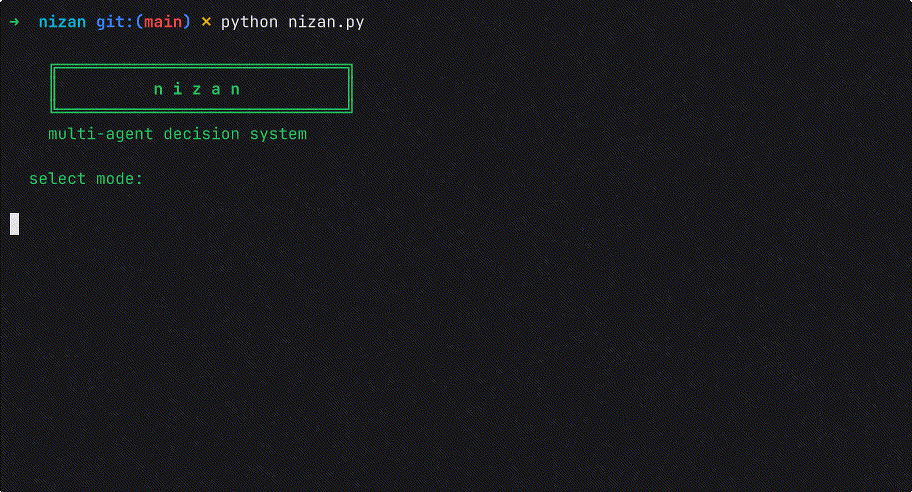

# nizan

a multi-agent debate and decision system. four AI agents with distinct roles engage in structured argumentation. the process produces an emergent verdict no single agent could reach alone.

*a tool to emerge some truth from variety.*

> <sub>work in progress — actively being built.</sub>

<p align="center">
  
</p>

---

## setup

### 1. clone the repo

```bash
git clone <repo-url>
cd nizan
```

### 2. create a virtual environment

```bash
python3 -m venv .venv
source .venv/bin/activate
```

> on windows: `.venv\Scripts\activate`

### 3. install dependencies

```bash
pip install -r requirements.txt
```

### 4. configure your model and API key

copy the example env file and fill in your values:

```bash
cp .env.example .env
```

edit `.env` with your model and key:

```env
MODEL=anthropic/claude-sonnet-4-20250514
ANTHROPIC_API_KEY=your-key-here
```

`.env` is gitignored. keys stay local.

#### supported providers

nizan uses [litellm](https://docs.litellm.ai/docs/providers) to route to any LLM provider. set `MODEL` to the litellm format and add the matching API key.

| provider | MODEL example | env var |
|----------|---------------|---------|
| anthropic | `anthropic/claude-sonnet-4-20250514` | `ANTHROPIC_API_KEY` |
| openai | `gpt-4o` | `OPENAI_API_KEY` |
| google | `gemini/gemini-pro` | `GEMINI_API_KEY` |
| groq | `groq/llama-3.1-70b-versatile` | `GROQ_API_KEY` |
| together | `together_ai/meta-llama/Llama-3-70b` | `TOGETHERAI_API_KEY` |
| fireworks | `fireworks_ai/llama-v3-70b` | `FIREWORKS_API_KEY` |
| ollama (local) | `ollama/llama3` | none needed |
| lm studio (local) | `lmstudio/model-name` | none needed |

if `MODEL` or the required API key is missing, nizan will print an error and exit before running.

---

## usage

### interactive menu (recommended)

```bash
python nizan.py
```

the menu walks you through:

1. **select mode**: normal or decision (arrow keys)
2. **guidelines**: how to frame your topic for the selected mode
3. **enter topic**: type your question
4. **context file** (optional): path to a document to ground the debate in
5. **select rounds**: 1 to 4 (arrow keys, default 2)
6. the debate runs

### quick run

```bash
python debate.py "should AI be open source?"
```

runs a normal-mode debate with 2 rounds.

### clean saved records

```bash
python clean.py
```

select which folder to clean (sigil or ruling), review the files, confirm deletion.

---

## modes

### normal mode

structured debate. one side argues FOR, the other AGAINST.

```
    MODERATOR         frames the topic, sets rules
        │
        ▼
    ADVOCATE          argues FOR the position
        │
     CRITIC           argues AGAINST the position
        │
    (repeat for N rounds)
        │
        ▼
      JUDGE           scores both sides, picks a winner
```

- **advocate** builds the strongest case for the position
- **critic** dismantles it with precision, steel-manning before countering
- **judge** scores 1-10 per side, delivers a verdict with reasoning

records saved to `sigil/`.

how to frame your topic:

```
good:
  "should AI models be open source?"
  "is remote work better than office work?"

bad:
  "what is machine learning?"     (not debatable)
  "list the benefits of X"        (one-sided)
```

### decision mode

structured decision analysis. both sides champion a specific option.

```
    MODERATOR         frames two options (A and B)
        │
        ▼
    ADVOCATE          argues FOR Option A
        │
     CRITIC           argues FOR Option B
        │
    (repeat for N rounds)
        │
        ▼
     JUDGE            conditional recommendation
```

- **advocate** champions Option A with evidence and trade-offs
- **critic** champions Option B (not just attacking A, building B's case)
- **judge** gives a conditional recommendation: "choose A if..., choose B if..."

decision mode also lets you select **priorities** (up to 3) that shape the judge's recommendation:

```
reversibility       — I need to be able to undo this
risk tolerance      — I can't afford to fail
time pressure       — I need to decide now
cost                — resources are limited
optionality         — keep future paths open
long-term alignment — must fit where I'm going
```

the judge weighs arguments through these lenses, producing a recommendation aligned with what actually matters to the decision-maker.

records saved to `ruling/`.

how to frame your topic:

```
good:
  "rust vs go for a new CLI tool"
  "postgres vs mongodb for user analytics"

bad:
  "what database should I use?"   (too vague, no two options)
  "is rust good?"                  (not a choice)
```

### context injection (RAG)

optionally provide a document (`.md`, `.txt`) to ground the debate in real information. the file is chunked, embedded, and stored in a local vector database (ChromaDB). the most relevant chunks are retrieved using the topic as a query and injected into the shared transcript before the debate starts.

all agents reason against the actual document, not just general knowledge.

---

## how it works

```
agent = system prompt + shared transcript → response
```

each agent is a role encoded in a system prompt, reading a shared transcript (the sigil), producing its contribution. the transcript is the shared reality. every agent sees everything before it speaks.

```
         MODERATOR
             │
             ▼
    ADVOCATE ⇄ CRITIC      (direct exchange, N rounds)
             │
             ▼
           JUDGE            (observes all, speaks last)
```

agents don't talk to each other directly. they all read and write to the same growing transcript. the orchestrator (`debate.py`) controls the order.

---

## project structure

```
nizan/
├── agents/
│   ├── moderator.py        ← frames the topic
│   ├── advocate.py         ← argues FOR / Option A
│   ├── critic.py           ← argues AGAINST / Option B
│   └── judge.py            ← evaluates and verdicts
├── core/
│   ├── llm.py              ← LLM wrapper (litellm, any provider)
│   ├── rag.py              ← RAG context retrieval (chromadb)
│   └── sigil.py            ← shared transcript class
├── sigil/                  ← saved debate records (normal mode)
├── ruling/                 ← saved decision records (decision mode)
├── debate.py               ← orchestrator
├── nizan.py                 ← interactive CLI entry point
├── clean.py                ← clean saved records
├── config.py               ← settings + validation
├── requirements.txt
└── .env.example            ← .env template
```

---

## configuration

### .env

see [supported providers](#supported-providers) for model strings and API key variables.

### config.py

| constant | description | default |
|----------|-------------|---------|
| `ROUNDS` | default number of debate rounds | `2` |
| `MAX_ROUNDS` | max rounds selectable in menu | `4` |
| `DEFAULT_MODE` | default mode in menu | `"normal"` |

---

## requirements

- python 3.9+
- an API key for your chosen provider (or ollama/lm studio running locally)
- dependencies: `litellm`, `python-dotenv`, `simple-term-menu`, `chromadb`
